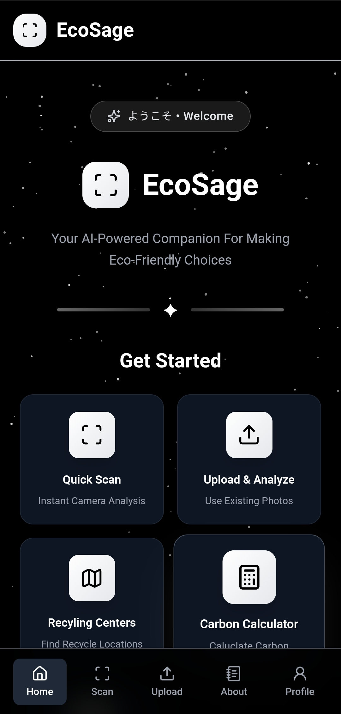
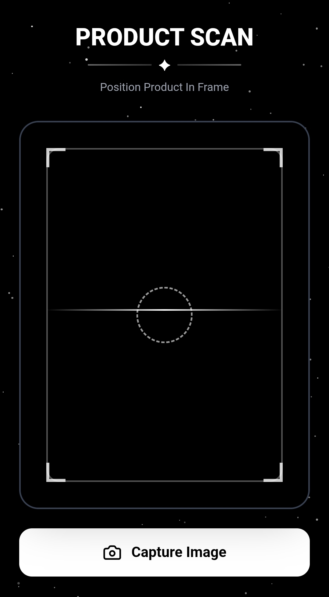
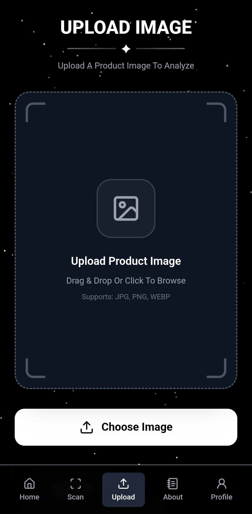
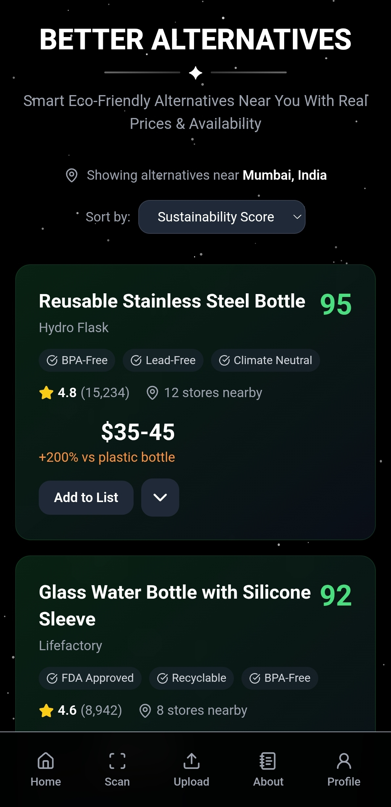
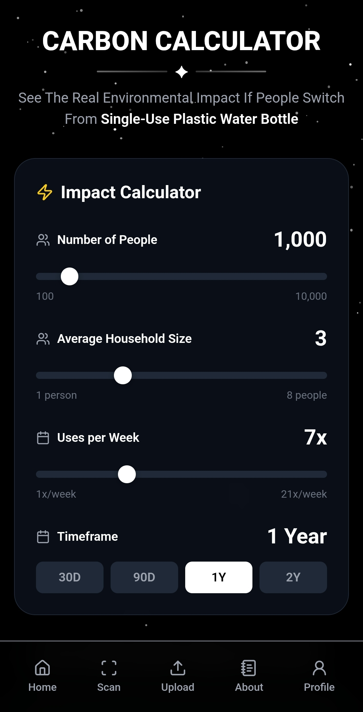
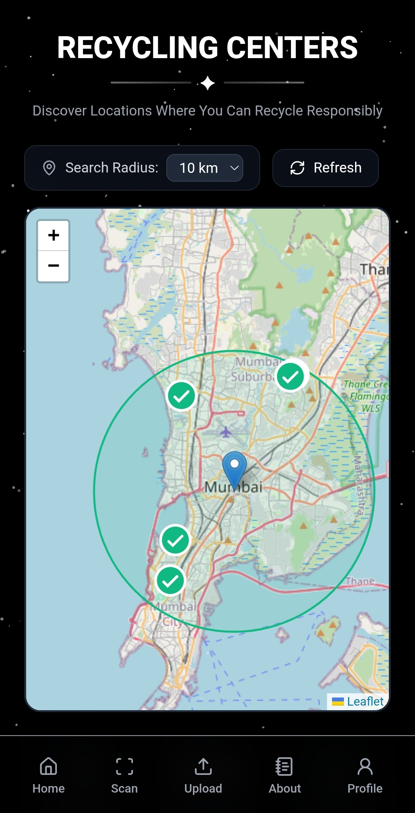
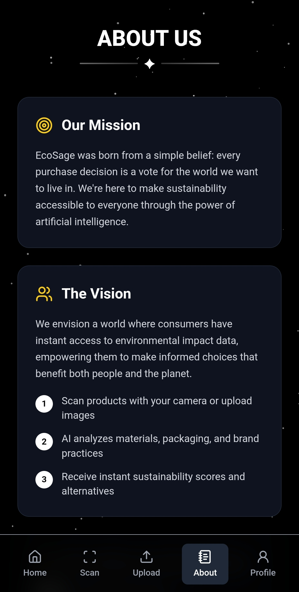
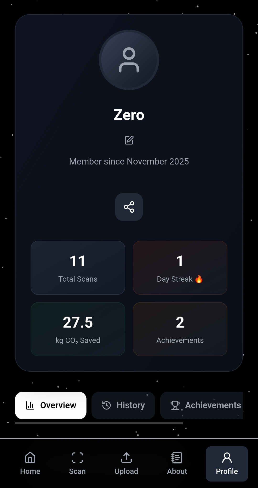

# 🍀 EcoSage – Your AI-Powered Sustainability Companion

EcoSage transforms everyday shopping into meaningful climate action. In a world drowning in greenwashing and confusing eco-labels, we've built the ultimate sustainability sidekick that empowers consumers to make informed, planet-friendly choices with every purchase. 

Powered by Google Gemini AI, real-time data analytics, and beautiful cosmic design, EcoSage doesn't just tell you what's wrong, it shows you better alternatives, calculates your environmental impact, and guides you to proper disposal. This isn't just another eco-app; it's a movement that turns individual choices into collective planetary healing.

<br>

## 📚 Table Of Contents

* [✨ Features](#-features)
* [📸 Preview](#-preview)
* [📁 Project Structure](#-project-structure)
* [⚙️ Technologies Used](#-technologies-used)
* [🚀 Getting Started](#-getting-started)
* [🧪 Usage Guide](#-usage-guide)
* [🎯 Core Features](#-core-features)
* [🌈 Customization](#-customization)
* [🛠️ Future Enhancements](#-future-enhancements)
* [🤝 Contributing](#-contributing)
* [📄 License](#-license)
* [🙌 Credits](#-credits)
* [📢 Author](#-author)

<br>

## ✨ Features

- **🔍 AI Product Scanner** – Instant sustainability analysis using Google Gemini Vision <br>
- **🔄 Smart Alternative Finder** – Curated eco-friendly replacements with store availability <br>
- **📊 Carbon Impact Calculator** – Live environmental savings visualization <br>
- **🗺️ Recycling Center Locator** – Real-time geolocation with directions <br>
- **🌱 Sustainability Dashboard** – Personal environmental impact tracking <br>
- **📈 Progress Analytics** – Lifetime carbon savings and achievements <br>
- **🎯 Educational Content** – Eco-facts and sustainability tips <br>
- **📱 PWA Ready** – Installable progressive web app <br>
- **✨ Cosmic UI Design** – Stellar-themed glassmorphism interface <br>

<br>

## 📸 Preview

| **Home Page** | **Product Scanner** |
|---------------|---------------------|
|  |  |

| **Upload Page** | **Alternative Finder** |
|----------------------|------------------------|
|  |  |

| **Carbon Calculator** | **Recycling Map** |
|-----------------------|-------------------|
|  |  |

| **About Us** | **Profile** |
|-----------------------|-------------------------|
|  |  |

<br>

## 📁 Project Structure

```bash
EcoSage/
└── 📁EcoSage_
    ├── 📁backend/
    │   ├── 📁src/
    │   │   ├── 📁config/
    │   │   │   └── gemini.ts                       # Google AI Configuration
    │   │   ├── 📁prompts/          
    │   │   │   └── ProductAnalysis.ts              # AI Analysis Prompts
    │   │   ├── 📁routes/           
    │   │   │   └── Analysis.ts                     # API Routes
    │   │   ├── 📁services/         
    │   │   │   └── ProductAnalysis.ts              # Business Logic
    │   │   └── server.ts                           # Express Server
    │   │           
    │   ├── .env                                    # Environment Variables
    │   ├── package.json                            # Backend Dependencies
    │   └── tsconfig.json                           # TypeScript Config
    │           
    ├── 📁frontend/         
    │   ├── 📁public/           
    │   │   ├── 📁icons/                            # PWA Icons
    │   │   │   ├── icon-144.png            
    │   │   │   ├── icon-192.png            
    │   │   │   └── ...         
    │   │   ├── 📁preview/                          # App Screenshots
    │   │   │   ├── Image_1-8.webp          
    │   │   ├── _redirects                          # Netlify Routing
    │   │   └── manifest.webmanifest                # PWA Manifest
    │   │           
    │   ├── 📁src/          
    │   │   ├── 📁components/                       # Reusable Components
    │   │   │   ├── BottomNav.tsx                   # Navigation Bar
    │   │   │   ├── Header.tsx                      # Page Header
    │   │   │   ├── StarsBackground.tsx             # Animated Background
    │   │   │   ├── EcoFacts.tsx                    # Educational Facts
    │   │   │   └── SustainabilityTips.tsx          # Green Living Tips
    │   │   │           
    │   │   ├── 📁data/                             # Static Data
    │   │   │   ├── EcoFacts.json           
    │   │   │   └── SustainabilityTips.json         
    │   │   │           
    │   │   ├── 📁pages/                            # Application Pages
    │   │   │   ├── HomePage.tsx                    # Landing Page
    │   │   │   ├── ScanPage.tsx                    # Product Scanner
    │   │   │   ├── UploadPage.tsx                  # Image Upload
    │   │   │   ├── ResultsPage.tsx                 # Analysis Results
    │   │   │   ├── AlternativeFinderPage.tsx       # Eco Alternatives
    │   │   │   ├── CarbonCalculatorPage.tsx        # Impact Calculator
    │   │   │   ├── RecyclingPage.tsx               # Center Locator
    │   │   │   ├── ProfilePage.tsx                 # User Dashboard
    │   │   │   └── AboutPage.tsx                   # App Information
    │   │   │           
    │   │   ├── 📁services/                         # API & Data Services
    │   │   │   ├── api.ts                          # Backend Communication
    │   │   │   └── ScanHistory.ts                  # Local Storage
    │   │   │           
    │   │   ├── App.tsx                             # Main Application
    │   │   ├── main.tsx                            # Entry Point
    │   │   └── vite-env.d.ts                       # TypeScript Definitions
    │   │           
    │   ├── package.json                            # Frontend Dependencies
    │   ├── tailwind.config.js                      # Styling Configuration
    │   ├── vite.config.ts                          # Build Configuration
    │   └── tsconfig.json                           # TypeScript Config
    │
    ├── .gitattributes
    ├── LICENSE
    └── README.md
```

<br>

## ⚙️ Technologies Used

| Technology | Purpose |
|------------|---------|
| **React 18 + TypeScript** | Type-safe frontend development |
| **Node.js + Express** | Robust backend API server |
| **Google Gemini AI** | Advanced product analysis and vision |
| **Tailwind CSS** | Utility-first responsive styling |
| **Framer Motion** | Smooth animations and transitions |
| **React Leaflet** | Interactive maps for recycling centers |
| **Vite** | Fast development and building |
| **PWA** | Installable app experience |

<br>

## 🚀 Getting Started

### Prerequisites
- Node.js (v18 or higher)
- npm or yarn
- Google Gemini API Key

### Installation

1. **Clone The Repository**
```bash
git clone https://github.com/FrostByte-49/EcoSage.git
cd EcoSage/EcoSage_
```

2. **Install Dependencies**
```bash
# Frontend dependencies
cd EcoSage_/frontend
npm install

# Backend dependencies
cd EcoSage_/backend
npm install
```

3. **Environment Setup**
```bash
# Backend .env file (backend/.env)
GEMINI_API_KEY=your_google_gemini_api_key_here
PORT=3001
NODE_ENV=development

# Frontend .env file (frontend/.env)
VITE_API_URL=http://localhost:3001/api
```

4. **Start Development Servers**
```bash
# Terminal 1 - Backend (http://localhost:3001)
cd EcoSage_/backend
npm run dev

# Terminal 2 - Frontend (http://localhost:5173)
cd EcoSage_/frontend  
npm run dev
```

5. **Open Your Browser:** 
Navigate to `http://localhost:5173` to start your sustainability journey!

<br>

## 🧪 Usage Guide

1. **🏠 Start at Home** – Explore the cosmic dashboard and app features
2. **🔍 Scan Products** – Use camera or upload images for instant sustainability analysis
3. **📊 Review Results** – Get detailed scores across packaging, production, and lifecycle
4. **🔄 Find Alternatives** – Discover better eco-friendly options with store availability
5. **📈 Calculate Impact** – Use interactive sliders to see your environmental savings
6. **🗺️ Locate Centers** – Find nearby recycling facilities with real-time directions
7. **👤 Track Progress** – Monitor your personal sustainability journey and achievements

<br>

## 🎯 Core Features

### 🔍 AI-Powered Product Analysis
- **Real-time Scanning**: Instant sustainability scoring using Google Gemini Vision
- **Comprehensive Metrics**: 
  - Packaging Score (0-3)
  - Production Score (0-3) 
  - Company Ethics (0-2)
  - Lifecycle Impact (0-2)
- **Actionable Insights**: Clear pros/cons and improvement recommendations

### 🔄 Smart Alternative Finder
- **Curated Eco-Options**: 5+ better alternatives with detailed comparisons
- **Real Store Integration**: Availability at Target, REI, Whole Foods, etc.
- **Smart Filtering**: Sort by sustainability score, price, or availability
- **Direct Links**: One-click access to purchase and directions

### 📊 Interactive Carbon Calculator
- **Live Impact Visualization**:
  ```typescript
  const calculateSavings = (users, frequency, timeframe) => {
    return users * frequency * timeframe * impactFactors;
  }
  ```
- **Tangible Comparisons**:
  - "Equivalent to planting 2,850 trees"
  - "Like removing 180 cars from roads"
  - "Powering 850 homes for a day"
- **Interactive Sliders**: Adjust usage patterns and see real-time results

### 🗺️ Recycling Center Locator
- **Real-time Geolocation**: Find nearest centers with Overpass API
- **Smart Radius Search**: 2km to 25km coverage areas
- **Live Directions**: One-tap navigation with Google Maps integration
- **Comprehensive Database**: 10,000+ centers across multiple categories

<br>

## 🌈 Customization

### Adding New Product Categories
1. Update analysis prompts in `backend/src/prompts/ProductAnalysis.ts`
2. Extend sustainability scoring algorithm
3. Add category-specific alternative databases

### Theming & Branding
- Modify `tailwind.config.js` for color scheme changes
- Update cosmic background gradients in `StarsBackground.tsx`
- Customize glassmorphism effects throughout components

### API Integrations
- Extend recycling center data sources
- Add more retail partnerships
- Integrate additional sustainability databases

<br>

## 🛠️ Future Enhancements

* [ ] **Multi-language Support** for global accessibility
* [ ] **Advanced Barcode Scanning** for instant product lookup
* [ ] **Social Features** – challenges and community impact
* [ ] **Retail Partnerships** – direct eco-product purchasing
* [ ] **Supply Chain Transparency** – blockchain verification
* [ ] **Carbon Offset Marketplace** – direct environmental contributions
* [ ] **Voice Assistant Integration** – hands-free product analysis
* [ ] **Educational Gamefication** – sustainability learning quests

<br>

## 🤝 Contributing

We welcome contributions to make EcoSage even more impactful! 

### How To Contribute

1. **Fork the repository**
2. **Create a feature branch**
```bash
git checkout -b feature/amazing-sustainability-feature
```
3. **Commit your changes**
```bash
git commit -m "🌱 Add: Amazing sustainability feature"
```
4. **Push to the branch**
```bash
git push origin feature/amazing-sustainability-feature
```
5. **Open a Pull Request**

### Areas For Contribution
- 🌍 Environmental data accuracy and expansion
- 🎨 UI/UX improvements and accessibility
- 🔧 Backend API enhancements and optimization
- 📚 Educational content and eco-tips
- 🧪 Testing and performance improvements
- 🌐 Internationalization and localization
- 📱 Mobile experience enhancements

<br>

## 📄 License

This Project is licensed under the [MIT License](https://opensource.org/licenses/MIT). Feel free to explore and build upon it. <br>
**© 2025 Pranav Khalate**  

```text
Permission Is Hereby Granted, Free Of Charge, To Any Person Obtaining A Copy...
```


<br>

## 🙌 Credits

* **Google Gemini AI** – Powering our intelligent product analysis and vision capabilities
* **OpenStreetMap & Overpass API** – Real-time recycling center data
* **Tailwind CSS** – Beautiful, responsive styling foundation
* **React Leaflet** – Interactive mapping solutions
* **Framer Motion** – Smooth, engaging animations
* **Environmental Protection Agency** – Carbon calculation standards and data

<br>

## 📢 Author

**Created With 💚 For A Sustainable Planet**

[](https://ecosage.netlify.app)
[](https://github.com/FrostByte-49) &nbsp;
[](https://www.linkedin.com/in/pranav-kh/) &nbsp;
[](mailto:pranav.kh49@gmail.com) &nbsp;
[](https://discord.com/users/1377918872925241375)

<br>

## 🌟 Support The Movement

If EcoSage helps you make more sustainable choices, please consider giving it a ⭐️ on GitHub. It helps spread environmental awareness and empowers more people to join the sustainability revolution!

> At EcoSage, We're Not Just Building An App, We're Cultivating A Global Movement Where Every Purchase Becomes A Vote For The Planet We Want To Inherit.

> *Ready To Transform Your Shopping Into Climate Action? The Future Is In Your Hands!*

<br>

```text
🌍 "We Do Not Inherit The Earth From Our Ancestors; We Borrow It From Our Children."

    – Native American Proverb
```
